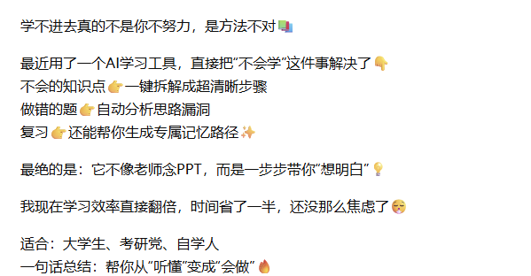
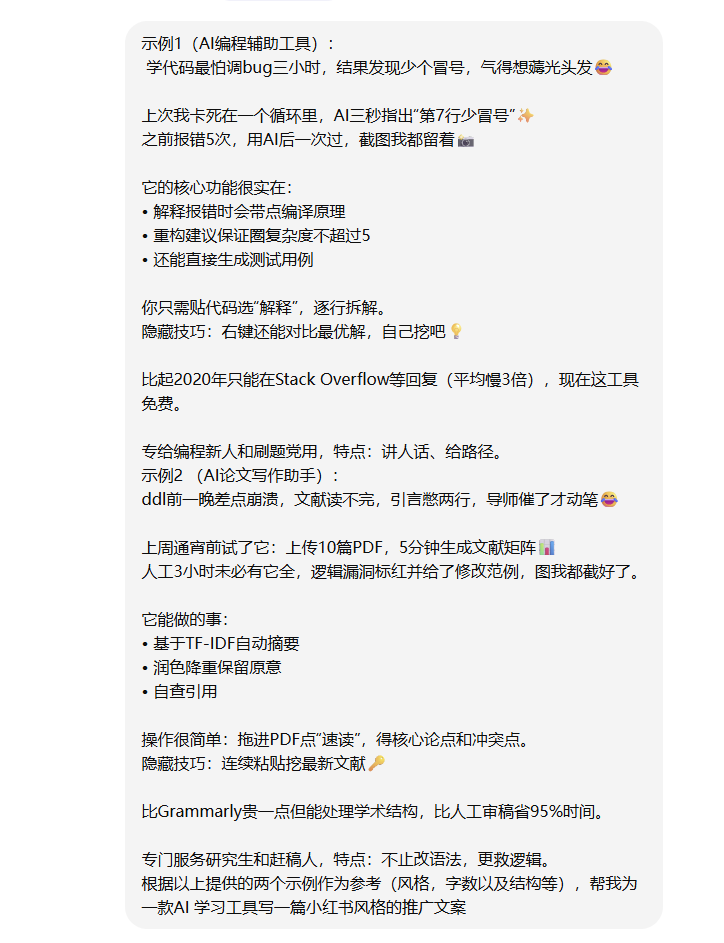
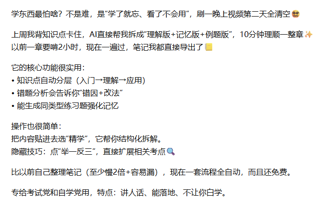
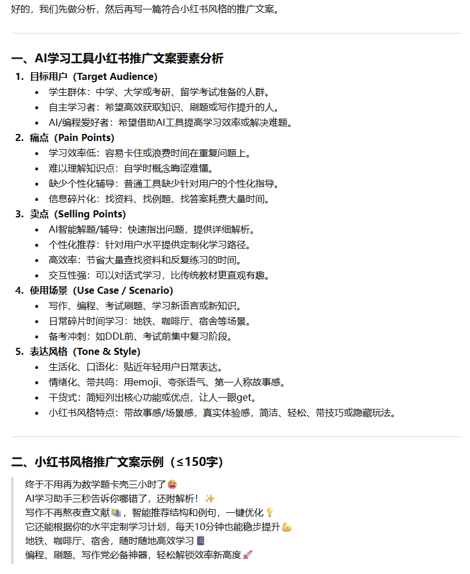
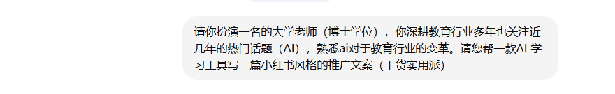
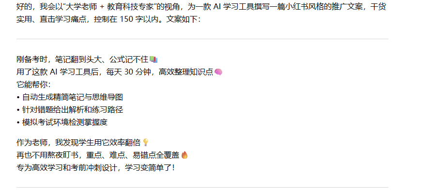

<p align="center">
  <strong><font size="6">主流Prompt工程技巧研究与实践文档</font></strong>
</p>

## 1. 任务背景
&nbsp;&nbsp;&nbsp;&nbsp;本报告围绕主流 Prompt Engineering 技巧展开研究与实践，其主要包括以下方法：Zero-shot Prompting、Few-shot Prompting、Chain-of-Thought Prompting 和 Role-playing Prompting。本报告首先将介绍 Prompt Engineering 的定义与背景，其次
针对于 Prompt Engineering 主流技巧依次进行介绍原理和结构以及使用方法，并给出实际应用场景。在此基础上本报告将这四种主流技巧在统一任务下进行对比。随后对于每个不同技巧的输出结果进行分析其优劣势并给出结论 最后本报告将结合实验结果对不同 Prompt 技巧进行综合评价。
本次实验使用 ChatGPT（GPT-5.3 模型）进行测试，在统一模型环境下对不同 Prompt 技巧进行对比分析，以保证实验结果的可比性。
## 2. Prompt Engineering 简介  
&nbsp;&nbsp;&nbsp;&nbsp;Prompt Engineering（提示工程）是指用户或者开发人员通过人类的自然语言的描述来引导大语言模型生成符合预期输出的一种技术方法。
此方法无需修改模型参数，也不需要进行模型的重新训练，而是利用模型的上下文学习能力，通过自然语言对模型进行“指令编程”。现如今，Prompt Engineering 已应用于文本生成、问答系统、推理任务及多模态生成等领域
其主要的技术方法包括 Zero-shot Prompting （零样本提示）、Few-shot Prompting （少样本提示）、Chain-of-Thought Prompting （思维链）和 Role-playing Prompting （角色扮演提示）。
## 3. 主流 Prompt 技巧研究
### 3.1 Zero-shot Prompting （零样本提示）
#### 定义： 
&nbsp;&nbsp;&nbsp;&nbsp;Zero-shot Prompting （零样本提示）是一种 Prompt Engineering 技巧，它不需要用户提供输入输出示例，而是通过自然语言指令直接描述任务目标来完成任务。它依赖模型在预训练
阶段中学习获取到的语言知识、常识、任务模式以及语言理解能力。
#### 原理（三步原理）：
1. 大语言模型在训练过程中接触过大量文本，包括说明文、问答、分类、翻译、总结、代码、论文、网页内容等。
2. 大语言模型能够理解自然语言指令来推断任务类型。零样本提示的核心在于通过任务描述引导模型，而不是通过示例进行学习。
3. 模型会根据上下文推断输出格式。（例如在指令中输入：请判断这句话的情感特征是消极，积极或者中立。只输出消极，积极或者中立。
那么模型的输出格式为被限制为“积极” or “消极” or “中立”三种标签之一 。
#### 结构：
一个零样本提示通常结构如下：
任务描述+ 输入内容+ 输出格式要求
#### 运用场景： 
适用于任务清晰，规则和逻辑不复杂，模型已有的知识框架基础上的应用场景 。
1. 文本分类
2. 文本总结
3. 文本翻译
4. 信息提取
5. 日常简单问题回答
6. 解释说明
### 3.2 Few-shot Prompting （少样本提示）
#### 定义：
&nbsp;&nbsp;&nbsp;&nbsp;Few-shot Prompting（少样本提示）是一种 Prompt Engineering 技巧，它通过提供少量输入输出示例，使大语言模型理解任务要求、输出格式以及判断标准，从而完成新的相似任务。
#### 原理:
Few-shot Prompting的核心原理是in-context learning（上下文学习）
1. 用户的示例提供任务模式（识别问题的类别， 学习输入输出的要求以及输入和输出之间的关系）
2. 模型通过上下文的输入和输出归纳规则，而不是通过参数更新或模型再训练来学习
3. 模型模仿示例格式完成新任务（新任务的要求和输出遵循示例的格式和模式）
#### 结构:
任务说明+ 示例1+示例2+新任务内容输入+ 输出
#### 运用场景：
适合用于任务规则比 Zero-shot 更复杂，或者需要模型稳定模仿特定格式的场景。
1. 文本分类（情感分析，主题判断，Few-shot 可以通过示例让模型理解不同类别的判断标准，相比于Zero-shot输出更加稳定）
2. 固定格式输出（JSON文件，表格，评分结果）
3. 文案风格模仿（写正式邮件，学术结构摘要，营销文案等）
4. 复杂分类或边界模糊任务（如果情感分析的边界模糊例如积极，消极或者中立， 示例能够帮助更好的理解分类）
### 3.3 Chain-of-Thought Prompting （思维链）
#### 定义：
&nbsp;&nbsp;&nbsp;&nbsp;Chain-of-Thought Prompting（思维链） 是一种 Prompt Engineering 技巧，指通过引导模型进行分步推理，帮助模型在完成复杂任务之前先分析中间过程，给出最终答案的方法。

#### 原理:
Chain-of-Thought Prompting 核心原理是通过显式展示或引导中间推理过程，让模型更容易完成多步骤任务。
换句话说， Chain-of-Thought Prompting 中，通过“step by step”指令，模型被引导逐步分析问题，模型被引导逐步分析问题、识别关键条件、拆解推理步骤，并在最后形成结论。
1. 把复杂问题拆解成中间步骤（例如请一步一步分析这个问题并进行详细严谨的推理，并给出最终答案。）（或者按照用户指定的推理和思路来命令大模型）
2. 让模型在上下文中学习推理模式（可以进行与Few-shot Prompting 相结合的方法，在 Prompt 中给几个带有推理过程的示例。模型会从示例中学习）
#### 结构:
1. （Zero-shot CoT）
任务说明+ “请一步一步思考/分析/推理，并给出最终答案。（所有的推理过程和参考的信息都必须真实、准确，不能有错误。给我你参考的网址或者文章）”
2. （Few-shot CoT）
示例1（问题加推理过程）+示例2（同上）+新问题说明+ “按照上述的例子请一步一步思考/分析/推理，并给出最终答案。”
  
#### 运用场景：
Chain-of-Thought Prompting 适合用于需要多步骤推理、逻辑分解或中间计算的任务。
1. 逻辑推理题
2. 数学应用题 
3. 复杂的决策分析或者复杂文档分析
4. 代码调试
5. 学术文章的分析以及论证
### 3.4 Role-playing Prompting （角色扮演）
#### 定义：
&nbsp;&nbsp;&nbsp;&nbsp;Role-playing Prompting（角色扮演）是一种 Prompt Engineering 技巧，用户通过Prompt中为大语言模型设定一个明确的角色、身份、专业背景或沟通风格，使模型模拟该角色的分析视角、表达方式和任务目标来生成回答。
#### 原理:
Role-playing Prompting 的核心原理是：通过角色设定为模型提供任务语境、专业视角和表达风格约束，从而让模型输出更符合用户预期
1. 设定角色，明确回答视角：用户告诉模型该角色的背景、角色身份、角色风格、角色任务目标，让模型按照该角色的设定来生成回答。（例如对于网络安全隐患相关，可以让大模型扮演一位资深的网络安全专家进行分析推理，
这样模型会更倾向于从漏洞、风险、攻击面、防护措施等角度回答即回答的角度符合专项需求而不是泛回答）
2. 约束语气、风格和输出深度：用户可以通过 Prompt 中添加语气、风格、深度限制，让模型生成更符合用户需求的回答。（例如使用鼓励的语气来客观评价我的简历/以学术评审的身份使用批判性思维来评估这篇文章/用更加简单易懂的分析）
3. 提高任务相关性 （角色设定可以减少回答过于泛泛的问题）

#### 结构:
角色设定+ 语气、风格、深度限制+ 任务描述和要求  
你是……（角色）  
你的任务是……（任务目标）  
请从……角度分析（专业视角/约束语气和风格）  
输出格式为……（格式要求）  
注意不要……（限制条件）  
#### 运用场景：
Role-playing Prompting 适合用于需要特定专业视角、特定表达风格或特定应用场景的任务。
1. 课程学习（教学分析）
2. 专业分析 （扮演网络安全工程师、软件架构师、数据分析师来分析问题）
3. 写作风格控制（技术文章， 营销文案， 广告会有不同的风格）
4. 模拟对话和面试（初学者练习语言， 面试模拟）

## 4. 不同 Prompt 技巧的实践结果
&nbsp;&nbsp;&nbsp;&nbsp;接下来是展示对各种 Prompt 技巧的提问以及输出结果，针对于同一个问题：“帮我为一款AI 学习工具写一篇小红书风格的推广文案”
### 4.1 Zero-shot 实践
针对于Zero-shot，输入如下：“帮我为一款AI 学习工具写一篇小红书风格的推广文案”(如下图包含prompt以及输出结果)

```azure
-- 帮我为一款AI 学习工具写一篇小红书风格的推广文案 （字数在150字以内）
```
<p align="center">
  
  <br>
  <em>图1：Zero-shot 提示词输入</em>
</p>
<p align="center">
  
  <br>
  <em>图2：Zero-shot 输出结果</em>
</p>

 
### 4.2 Few-shot 实践
针对于Few-shot，加上两个示例让模型进行模仿：  
（prompt）  
```azure
-- 示例1（AI编程辅助工具）：
--  学代码最怕调bug三小时，结果发现少个冒号，气得想薅光头发😂
-- 
-- 上次我卡死在一个循环里，AI三秒指出“第7行少冒号”✨
-- 之前报错5次，用AI后一次过，截图我都留着📸
-- 
-- 它的核心功能很实在：
-- • 解释报错时会带点编译原理
-- • 重构建议保证圈复杂度不超过5
-- • 还能直接生成测试用例
-- 
-- 你只需贴代码选“解释”，逐行拆解。
-- 隐藏技巧：右键还能对比最优解，自己挖吧💡
-- 
-- 比起2020年只能在Stack Overflow等回复（平均慢3倍），现在这工具免费。
-- 
-- 专给编程新人和刷题党用，特点：讲人话、给路径。
-- 示例2 （AI论文写作助手）：
-- ddl前一晚差点崩溃，文献读不完，引言憋两行，导师催了才动笔😂
-- 
-- 上周通宵前试了它：上传10篇PDF，5分钟生成文献矩阵📊
-- 人工3小时未必有它全，逻辑漏洞标红并给了修改范例，图我都截好了。
-- 
-- 它能做的事：
-- • 基于TF‑IDF自动摘要
-- • 润色降重保留原意
-- • 自查引用
-- 
-- 操作很简单：拖进PDF点“速读”，得核心论点和冲突点。
-- 隐藏技巧：连续粘贴挖最新文献🔑
-- 
-- 比Grammarly贵一点但能处理学术结构，比人工审稿省95%时间。
-- 
-- 专门服务研究生和赶稿人，特点：不止改语法，更救逻辑。
-- 根据以上提供的两个示例作为参考（风格，字数以及结构等），帮我为一款AI 学习工具写一篇小红书风格的推广文案
```
<p align="center">
  
  <br>
  <em>图3：Few-shot 提示词输入</em>
</p>
   
（输出结果）  
<p align="center">
  
  <br>
  <em>图4：Few-shot 输出结果</em>
</p>

### 4.3 CoT 实践  
针对于CoT，会让先模型进行推理分析：   
(prompt)  
```azure
-- 请先分析一款AI 学习工具的小红书推广文案应该包含哪些要素，例如目标用户、痛点、卖点、使用场景和表达风格。
-- 然后再根据分析结果，写一篇小红书风格推广文案（字数控制在150字以内，分析字数不限）
```
<p align="center">
  
  <br>
  <em>图5：Cot 提示词输入</em>
</p>
 
(输出结果)  
<p align="center">
  
  <br>
  <em>图6：Cot 输出结果</em>
</p>


### 4.4 Role-playing 实践  
针对于Role-playing，会设定角色，让模型按照角色设定进行推理  
```azure
-- 请你扮演一名的大学老师（博士学位），你深耕教育行业多年也关注近几年的热门话题（AI），熟悉ai对于教育行业的变革。
-- 请您帮一款AI 学习工具写一篇小红书风格的推广文案（干货实用派）
```
(prompt)   
<p align="center">
  
  <br>
  <em>图7：Role-Playing 提示词输入</em> 
</p>
 
(输出结果)   
<p align="center">
  
  <br>
  <em>图8：Role-Playing 输出结果</em> 
</p>


## 5. 效果对比分析
### 5.1 Zero-shot ：  
&nbsp;&nbsp;&nbsp;&nbsp;直接请求模型生成小红书风格文案，限制字数≤150，输出的文案生动，具有emoji，并且符合常规小红书的风格。结果直接描述工具功能，列出核心卖点。
结尾给出受众总结（大学生、考研、自学人）。  
优点：  
a. 简单直接，快速生成文案 （便捷）  
b. 符合常规小红书的风格 （大模型自动识别风格）  
c. 输出的结果基本信息没有错误  
劣势：  
a. 输出结果缺少系统分析，卖点和痛点的逻辑层次不清晰。整个文案信息“跳跃”，缺乏衔接词和逻辑说明  
b. 文案偏经验性描述，缺少结构化的策略分析。  
c. 有些信息略显片段化（功能点杂乱）。  
  
总结：虽然整体文案的方向和内容没有问题，但是整体结构和逻辑层次完全由大模型自己处理。没有经过人工筛选调整结构导致生成的文本缺少固定的结构。因此文本缺乏固定结构。不同生成结果可能结构不一致。  
### 5.2 few-shot:   
&nbsp;&nbsp;&nbsp;&nbsp;提供两个示例(AI编程辅助工具,和AI论文写作助手)，模型模仿示例风格生成目标文案  
优点：  
a.输出风格相对更稳定，模仿能力强。模型能够学习示例中的表达方式和风格（故事开头 + 功能说明 + 使用技巧）。  
相比 Zero-shot，生成结果更接近“人工写作风格”。  
b. 文案包含操作技巧和具体功能描述。(严格遵循提供的示例风格和结构，相比于zero-shot 结构不混乱）  
劣势：  
a. 结果输出依赖于示例的结构的输出风格，因此在提供多个示例风格和结构不统一时， 输出结构不稳定  
    
总结：由于模型有示例，因此生成结果更符合示例要求。（示例由人工审核和提供，因此结构更加固定，结果的输出较稳定）， 然而如果示例示例风格不统一可能导致杂合输出。  
### 5.3 CoT：   
&nbsp;&nbsp;&nbsp;&nbsp;Prompt 先要求模型进行分析（用户、痛点、卖点、使用场景和表达风格等方面，然后模型进行推理，生成结果）  
优点：  
a. 模型在输出文案前会给出分析步骤（用户、痛点、卖点等）。用户可以检查分析是否合理，从而判断最终结果的可靠性。同时也具备一定的“模型自查”能力。  
b. 文案逻辑清晰、结构化完整。相比于 zero-shot 和 few-shot，信息组织更有条理。  
c. 由于分析过程被展示，用户可以针对某一部分进行调整（如只修改目标用户或卖点），来进行优化迭代  
劣势：  
a. 输出结果过于理性话，缺少幽默感（不适合写小红书平台的文案，故事感和口语化较弱。）   
  
总结： CoT 方法通过先分析再生成的方式，使输出结果具有较强的逻辑性和结构性，不仅如此还提供完整的推理过程，便于用户审查和优化。在需要严谨分析或结构化输出的任务中（如问题分析、技术解释，数学推理），具有较高的准确性和可控性。
但在社交媒体文案（如小红书）场景中，由于其表达偏理性，缺少情绪化和故事化表达，因此表现不如 Few-shot 或 Role-playing 自然。  
### 5.4 Role-Playing  
&nbsp;&nbsp;&nbsp;&nbsp;Prompting指定角色，模型按角色身份生成文案  
优点：    
a. 模型按照角色设定进行推理，生成结果按照角色的角度更加贴合特定产品文案,展现其权威性和专业性（模型明显受到“大学老师”角色影响，引入真实学习痛点。突出的是教育场景中的实用功能，而不是单纯夸产品）  
b. 使用体验清晰（文案没有只说“很好用”“效率高”，而是列出具体功能，作为教育行业者的推荐让读者能理解工具具体能做什么，实用性比较强）    
c. 表达自然贴合（相比于cot更加自然）  
劣势：  
a. 对角色设定依赖较高 (Role-playing 的效果很大程度取决于角色是否合适。大学老师比较适合 AI 学习工具，所以输出较自然。但是如果角色设定不合理，  
例如让模型扮演“金融分析师”来写 AI 学习工具文案，输出可能会偏离教育场景，影响文案质量。）  
b. 角色与任务类型不匹配（大学老师的身份强调可信度和专业性，而小红书文案强调轻松、生活化和分享感。以一个学术专业人的角度来写这种文案，输出可能会变成偏正式的教育推荐）  
  
总结：   
&nbsp;&nbsp;&nbsp;&nbsp;Role-playing 通过设定“大学老师”角色，使模型从教育专业人士的视角生成文案。文案能够结合学生备考、笔记整理、错题解析等学习场景，体现出较强的专业性和说服力。  
同时，输出中也包含“笔记翻到头大”“不用熬夜补书”等口语化表达，因此比 CoT 更有故事感和真实场景感。但 Role-playing 的效果高度依赖角色设定。如果角色与任务不匹配，生成结果可能偏离目标风格。   
因此，Role-playing 更适合需要专业背书、信任感和场景化表达的文案任务。   
### 5.5 综合分析：
1. Zero-shot ：优点是生成速度快、风格自然，但结构完全依赖模型，逻辑不稳定。适合快速生成社交媒体推广文案。
文案不要求复杂分析，仅需吸引眼球
2. Few-shot ：通过示例引导，提升了结构稳定性和表达质量（综合表现相比于zero效果更佳），但依赖示例质量，可能出现风格杂合。适合高细节文案、教程或经验分享型推广。
展示复杂操作或功能流程
3. Cot： 通过“先分析再生成”，增强了逻辑性和结构性，同时提高了结果可控性，但表达偏理性，适合复杂推理分析的场景，不适合情绪化较强的社交媒体文案。
4. Role_Playing: 通过角色设定增强真实感和说服力，在社交媒体文案中表现最佳，但效果高度依赖角色设计，适合教育类产品等方面的推广，尤其需要权威性和体验感的场景。
## 6. 个人心得总结
&nbsp;&nbsp;&nbsp;&nbsp;通过本次对不同 Prompt 技巧的实践与对比分析，可以明显发现，不同方法在生成质量、结构控制以及表达风格上各有侧重。对于日常对逻辑性要求不高的任务中，Zero-shot 具有明显优势，其使用方式简单直接，能够快速生成符合基本要求的内容。
在此基础上，Few-shot 通过引入示例，为模型提供了明确的参考结构，使生成结果在一定程度上提升了输出的稳定性和可读性。其次逻辑性较强的任务（如数学推理、代码分析、问题拆解）更加适合cot技巧。 
在进行需要沉浸受众角色的角度进行分析文案，产品分析过程中，Role_Playing 的优势明。
&nbsp;&nbsp;&nbsp;&nbsp;最后针对于不同任务，不同的需求场景采取的策略和技巧不同， 灵活运用以及将四种主要prompting技巧结合使用效果会更好。
