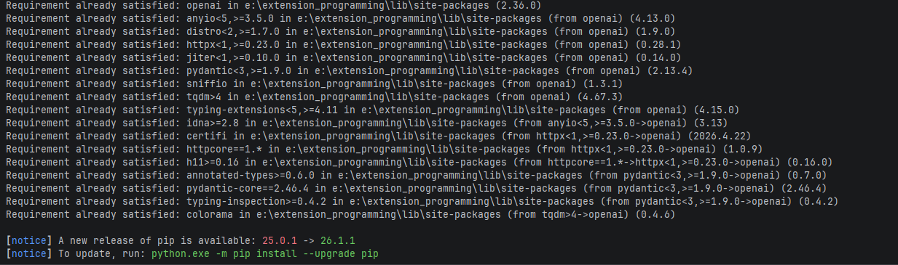
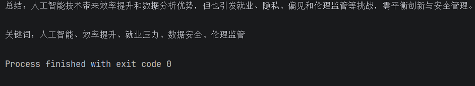

# Python调用大模型API实现文本处理工具脚本

## 1. 项目简介
本项目是基于python调用大模型的 API 实现文本处理，并提供一个名为sample.txt的文本文件作为输入，对其中的文本进行 “摘要总结” 以及 “提取五个关键词” 。并将输出结果打印在 Terminal 控制台中。
注意： 本项目实践采用 DeepSeek API 调用，如若需要测试，请自行提供 DeepSeek 平台的API key 并加入到个人设备的的环境变量中。（DEEPSEEK_API_KEY）下面是的操作和实践是针对于 Windows 版本进行。
## 2. 文件结构
此次项目一共有三个文件， 文件结构如下
 ```
 项目文件结构如下：

week2/
├── text_processor.py   # 主程序脚本
├── sample.txt          # 示例文本文件
└── README.md           # 项目运行说明文档
 ```

## 3. 环境要求
1. Python 3.8 或以上版本
2. 已注册 DeepSeek 开发平台账号
3. 已经获取了 DeepSeek 账号的 API Key （并拥有足够的 Token 量）
4. 本项目使用 OpenAI Python SDK 调用 DeepSeek API。已安装 openai Python SDK
5. 本项目运行环境为 Pycharm IDE （设备本地 Powershell 运行也可）
## 4. 安装依赖
本项目脚本需要进行 python 的导入库如下：
```python
import os
from openai import OpenAI

```
并在终端 Terminal （IDE 自带即可）中运行如下命令：
```shell
pip install openai
```
运行成功后，即可在终端中看到如下信息：
```azure
-- Requirement already satisfied: openai in e:\extension_programming\lib\site-packages (2.36.0)
-- Requirement already satisfied: anyio<5,>=3.5.0 in e:\extension_programming\lib\site-packages (from openai) (4.13.0)
-- Requirement already satisfied: distro<2,>=1.7.0 in e:\extension_programming\lib\site-packages (from openai) (1.9.0)
-- Requirement already satisfied: httpx<1,>=0.23.0 in e:\extension_programming\lib\site-packages (from openai) (0.28.1)
-- Requirement already satisfied: jiter<1,>=0.10.0 in e:\extension_programming\lib\site-packages (from openai) (0.14.0)
-- Requirement already satisfied: pydantic<3,>=1.9.0 in e:\extension_programming\lib\site-packages (from openai) (2.13.4)
-- Requirement already satisfied: sniffio in e:\extension_programming\lib\site-packages (from openai) (1.3.1)
-- Requirement already satisfied: tqdm>4 in e:\extension_programming\lib\site-packages (from openai) (4.67.3)
-- Requirement already satisfied: typing-extensions<5,>=4.11 in e:\extension_programming\lib\site-packages (from openai) (4.15.0)
-- Requirement already satisfied: idna>=2.8 in e:\extension_programming\lib\site-packages (from anyio<5,>=3.5.0->openai) (3.13)
-- Requirement already satisfied: certifi in e:\extension_programming\lib\site-packages (from httpx<1,>=0.23.0->openai) (2026.4.22)
-- Requirement already satisfied: httpcore==1.* in e:\extension_programming\lib\site-packages (from httpx<1,>=0.23.0->openai) (1.0.9)
-- Requirement already satisfied: h11>=0.16 in e:\extension_programming\lib\site-packages (from httpcore==1.*->httpx<1,>=0.23.0->openai) (0.16.0)
-- Requirement already satisfied: annotated-types>=0.6.0 in e:\extension_programming\lib\site-packages (from pydantic<3,>=1.9.0->openai) (0.7.0)
-- Requirement already satisfied: pydantic-core==2.46.4 in e:\extension_programming\lib\site-packages (from pydantic<3,>=1.9.0->openai) (2.46.4)
-- Requirement already satisfied: typing-inspection>=0.4.2 in e:\extension_programming\lib\site-packages (from pydantic<3,>=1.9.0->openai) (0.4.2)
-- Requirement already satisfied: colorama in e:\extension_programming\lib\site-packages (from tqdm>4->openai) (0.4.6)
```
<p align="center">
  
  <br>
  <em>图1：pip open AI 指令输出结果</em>
</p>

## 5. 配置API Key
为了保护 API Key ，不建议将 API Key 直接写入 Python 文件中。本项目通过环境变量读取 API Key。
### Windows配置环境变量
1. 打开 cmd 终端或 PowerShell 终端
2. Windows 终端运行：
#### CMD 运行
```azure
-- 配置你的API Key
-- set DEEPSEEK_API_KEY=YOUR_API_KEY
-- 验证你的API Key
-- echo %DEEPSEEK_API_KEY%

```
#### PowerShell 运行
```azure
-- 配置你的API Key
-- $env:DEEPSEEK_API_KEY="xxx"
-- 验证你的API Key
-- echo $env:DEEPSEEK_API_KEY
```
3. ```md
配置完成后，程序会通过以下代码读取 API Key （代码在 text_processor.py 脚本中体现）：

```python
import os
api_key = os.environ.get("DEEPSEEK_API_KEY") #请将个人的api key 可以加入到环境变量中
```
## 6. 运行方法以及结果
在此之前请确保已经配置好环境变量，sample.txt已经存在。 然后通过 IDE 运行text_processor.py 脚本 即可在控制台中看到输出结果 也可以在设备本地 Powershell 中运行：
<p align="center">
  
  <br>
  <em>图2：IDE 运行结果</em>
</p>
注意在设备本地 Powershell 中运行时要将目录移动到项目目录下：

```azure
-- cd 你的目标目录
```

<p align="center">
  
  <br>
  <em>图2：PowerShell 运行结果</em>
</p>

## 7. 注意事项总结
1. 请不要将真实 API Key 上传到 GitHub 或提交到压缩包中。本项目并未将 api keyu 进行上传和公布，请采用自己的账号进行测试。
2. 如果程序提示 API Key 不存在，请检查环境变量是否配置成功。
3. 如果 API 调用失败，请检查网络连接、API Key 是否正确，以及账户是否还有可用额度。
