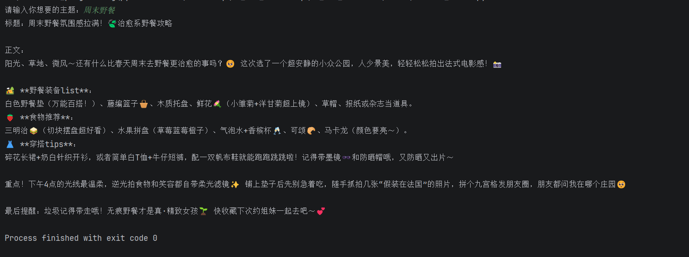
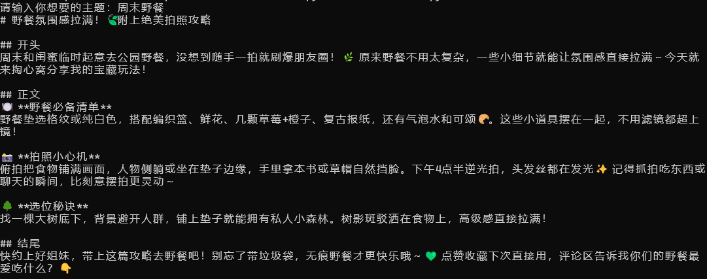

# LangChain 自动化内容生成链（小红书笔记生成）
## 1. 项目简介
本项目基于 主流的 LangChain 框架， 实现一个自动化内容生成链。项目程序工作流程是通过输入一个主题，系统能够自动完成生成标题以及正文内容。其中的要求如下：
1. 输入一个 “主题”，程序自动生成3个小红书笔记的 “标题”。
2. 程序自动选择其中一个作为笔记的 “标题”，并根据这个 “标题” 生成包含 emoji 表情的正文内容。（在程序中默认选取第一个）
结构如下：  
2.1 用户输入主题 --> 程序自动生成3个小红书笔记的 “标题” --> 程序自动选择其中一个作为笔记的 “标题” --> 程序自动生成包含 emoji 表情的正文内容 (程序逻辑结构)    
2.2 用户输入主题 --> 程序自动生成包含 emoji 表情的正文内容 (用户端结果呈现)   
3. 其次本程序基于 LangChain 的最新 Chain 设计，将输入主题、标题生成和正文生成三个步骤通过 Chain 自动串联起来：  
3.1 输入原始主题（RunnablePassthrough）    
3.2 使用第一个 PromptTemplate 生成三个小红书笔记标题  
3.3 提取第一个标题（RunnableLambda）  
3.4 使用第二个 PromptTemplate 生成正文草稿    
整个流程使用 Chain 将各步骤衔接，实现端到端自动化内容生成。  
（此次项目推荐运行在支持 Python 的IDE中，例如 PyChram。）  
## 2. 文件结构
 ```
content_chain.py      # 主 Python 脚本
requirements.txt      # Python 依赖
README.md             # 项目说明
 ```
## 3. 环境要求
1. Python 版本（>=3.8）
2. 依赖库：  
langchain  
langchain-openai  
openai  
- 安装命令：
```bash
# PyCharm IDE terminal 终端运行即可
pip install -r requirements.txt
```
（注意本次项目下面试验均在 PyCharm IDE 平台中进行测试，此外请务必安装必要的依赖库， 否则本脚本导入的模块你将无法运行）
```python
import os
import httpx
from langchain_core.runnables import RunnablePassthrough, RunnableLambda
from langchain_openai import ChatOpenAI
from langchain_core.prompts import PromptTemplate
from openai import OpenAIError, APIConnectionError
```
## 4. API Key 配置
为了保护 API Key ，不建议将 API Key 直接写入 Python 文件中。本项目通过环境变量读取 API Key。
### Windows 配置环境变量
1. 打开 cmd 终端或 PowerShell 终端
2. Windows 终端运行：
#### CMD 运行
```cmd
# 配置你的API Key
set DEEPSEEK_API_KEY=YOUR_API_KEY
# 验证你的API Key
echo %DEEPSEEK_API_KEY%

```
#### PowerShell 运行
```cmd
# 配置你的API Key
$env:DEEPSEEK_API_KEY="xxx"
# 验证你的API Key
echo $env:DEEPSEEK_API_KEY
```
配置完成后，程序会通过以下代码读取 API Key 
```python
import os
def get_api_key():
    api_key = os.environ.get("DEEPSEEK_API_KEY")  # 请将个人的api key 可以加入到环境变量中
    if not api_key:
        raise ValueError("DEEPSEEK_API_KEY is not set. Please configure your API key first.")
    return api_key
```
## 5. 运行项目
在此之前请确保已经配置好环境变量以及 requirements.txt 中的依赖库， 然后通过 IDE/CMD/Powershell 运行 content_chain.py 文件即可看到输出结果
### PyChram IDE 运行
<p align="center">
  
  <br>
  <em>图1：IDE 运行结果</em>
</p>

### CMD & PowerShell 运行  
注意在设备本地 PowerShell / CMD 中运行时要将目录移动到项目目录下：
```cmd
PowerShell 运行:
cd 你的目标目录

cmd 运行:
cd /d 你的目标目录
```
然后输入指令执行脚本:
```cmd
python content_chain.py
```
<p align="center">
  
  <br>
  <em>图2：cmd & PowerShell 运行结果</em>
</p>

## 6. 注意事项
1. 请不要将真实 API Key 上传到 GitHub 或提交到压缩包中。本项目并未将 api key 进行上传和公布，请采用自己的账号进行测试。
2. 如果程序提示 API Key 不存在，请检查环境变量是否配置成功。
3. 如果 API 调用失败，请检查网络连接、API Key 是否正确，以及账户是否还有可用额度。
4. 本项目调用的是 DeepSeek 平台的 API 服务，请提前注册 DeepSeek 开发平台账号并获取个人 API Key。
5. 本脚本内置异常处理，能够提示 API Key、网络或依赖问题，帮助用户顺利运行程序。